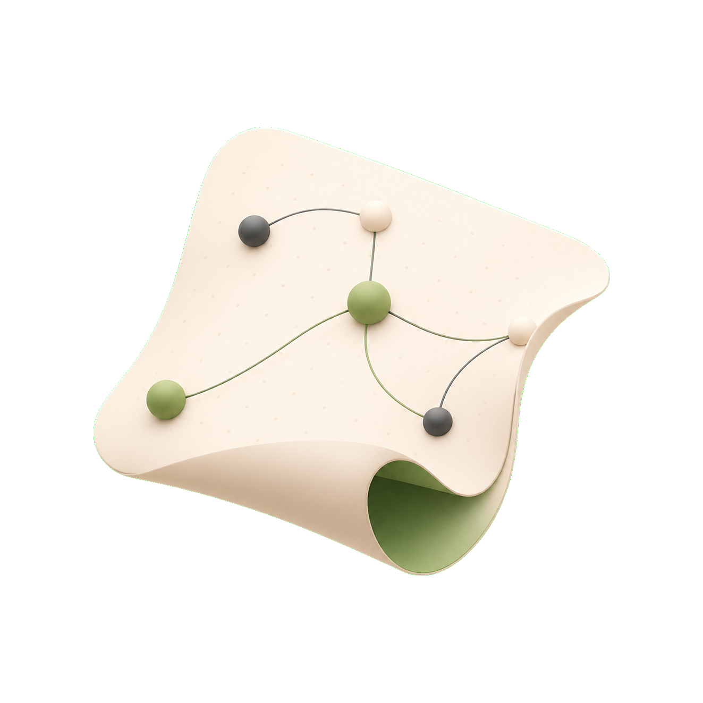

<p align="center">
  
</p>

# Mira

Mira is a local-first visual canvas for agents. It lets an agent place Markdown, HTML, images, and videos onto a clean board, while you preview the same context visually.

## Install The Skill

```bash
npx skills add oil-oil/mira
```

After installing the skill, ask your agent to use Mira when you want files previewed on a canvas.

## What Mira Does

- Previews Markdown, HTML, images, and videos as movable nodes.
- Lets agents import files, link folders, create Markdown notes, and copy context.
- Keeps workspace data local in `.canvas/`.
- Opens a local UI at `http://localhost:3020`.

## Agent Quick Start

Once the skill is installed, an agent can install and launch the CLI from GitHub:

```bash
npm install -g https://github.com/oil-oil/mira/archive/refs/heads/main.tar.gz
mira init
mira board create "Homepage Redesign" --json
mira import ~/Downloads/brief.md ~/Downloads/screenshot.png --json
mira serve --port 3020
```

## Commands

```txt
mira init
mira serve [--port 3020]
mira status [--json]
mira board list [--json]
mira board create <title> [--json]
mira board use <id> [--json]
mira comments list [--json]
mira comments node <node-id> [--json]
mira list [--json]
mira files [--json]
mira import <file...> [--json]
mira add <file...> [--json]
mira markdown [title] [--json]
mira link <path> [name] [--json]
mira context <node-id|all>
mira read <path>
mira write <path> <content>
```

## Supported Files

```txt
Markdown: .md .mdx .markdown
HTML:     .html .htm
Images:   .png .jpg .jpeg .gif .webp .svg .avif
Videos:   .mp4 .webm .mov .m4v
```

## Tech Stack

Mira uses Next.js, React, TypeScript, React Flow, Tiptap, Radix UI, and a Node.js CLI.

## License

MIT
